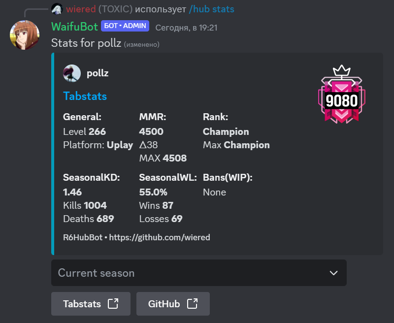

# Tabstats died, so bot is broken :(

## R6Hub discord bot
Retrieve and View Rainbow Six: Siege Stats from tabstats.com in Discord Servers



## Installation

1. Clone this project
2. Install requirments 
```pwsh
pip install -r requirements.txt
```
4. Copy default_config.ini as config.ini
```pwsh
copy ./config/default_config.ini ./config/config.ini
```
4. Configure `.\configs\config.ini`
5. Done

## Configuration

Default configuration looks like this:

```ini
[DEFAULT]
token = TOKEN
log_level = INFO
guild_id = GUILD_ID
```

Replace `TOKEN` with your discord application token, and `GUILD_ID` with your guild ID


## Running

```pwsh
py .\bot.py
```

## Find a bug?

If you found an issue or would like to submit an improvement to this project, please submit an issue using the issues tab above. If you would like to submit a PR with a fix, reference the issue you created!

## License

This is free and unencumbered software released into the public domain.

Anyone is free to copy, modify, publish, use, compile, sell, or distribute this software, either in source code form or as a compiled binary, for any purpose, commercial or non-commercial, and by any means.